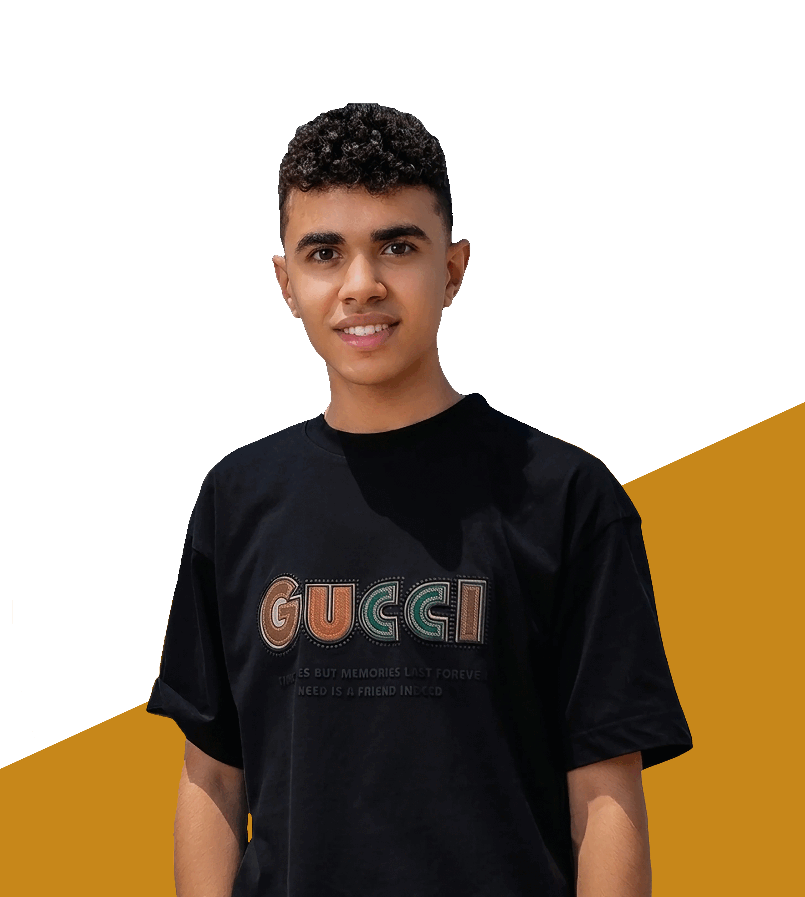

# Ahmed Shawky | Frontend Developer Portfolio

A modern, responsive, and bilingual (English/Arabic) portfolio website built with pure HTML, CSS, and JavaScript.



## 🚀 Live Demo

[View Live Portfolio](https://ahmedshawky10001-svg.github.io/portfolio-ahmed-shawky/)

## ✨ Features

- **Bilingual Support** — Full English & Arabic language toggle with RTL support
- **Responsive Design** — Optimized for all screen sizes (desktop, tablet, mobile)
- **Dark Theme** — Modern dark UI with orange & cyan accent colors
- **Smooth Animations** — Scroll-triggered animations, typing effect, and hover interactions
- **Mobile Navigation** — Hamburger menu with slide-in sidebar
- **Progress Bar** — Scroll progress indicator at the top
- **Contact Form** — Interactive form with validation and toast notifications
- **Back to Top Button** — Smooth scroll to top functionality

## 🛠️ Technologies Used

- **HTML5** — Semantic markup
- **CSS3** — Custom properties, Flexbox, Grid, Animations
- **JavaScript (Vanilla)** — No frameworks, pure JS
- **Font Awesome** — Icons
- **Google Fonts** — Outfit & Cairo fonts

## 📁 Project Structure

```
portfolio-ahmed-shawky/
├── index.html              # Main HTML file
├── css/
│   └── style.css           # All styles
├── js/
│   └── js.js               # All JavaScript functionality
├── assets/
│   └── images/             # Images & logos
│       ├── AhmedShawky.webp
│       ├── LOG.png
│       ├── LOGOO.png
│       ├── Foodie's11.webp
│       └── daily-azkar.webp
└── README.md               # This file
```

## 📱 Sections

1. **Hero** — Introduction with typing animation and floating tech cards
2. **About** — Personal info, bio, and contact details
3. **Skills** — Technical skills with animated progress bars
4. **Services** — Web Development, React, UI/UX, Responsive Design
5. **Projects** — Featured projects with live demo links
6. **Courses** — Training & certifications
7. **Contact** — Contact info and message form

## 🎨 Color Palette

| Color | Hex | Usage |
|-------|-----|-------|
| Primary | `#ff9800` | Buttons, accents, highlights |
| Secondary | `#00e5ff` | Glow effects, badges |
| Background | `#0a0a0a` | Main background |
| Card BG | `#111111` | Cards & sections |
| Text Primary | `#ffffff` | Headings |
| Text Secondary | `#b0b0b0` | Body text |

## 🚀 Getting Started

### Prerequisites

- Any modern web browser (Chrome, Firefox, Safari, Edge)
- Local server (optional, for local development)

### Installation

1. Clone the repository:
```bash
git clone https://github.com/ahmedshawky10001-svg/portfolio-ahmed-shawky.git
```

2. Navigate to the project folder:
```bash
cd portfolio-ahmed-shawky
```

3. Open `index.html` in your browser, or use a local server:
```bash
# Using Python 3
python -m http.server 8000

# Using Node.js (npx)
npx serve .

# Using PHP
php -S localhost:8000
```

4. Visit `http://localhost:8000` in your browser.

## 🌐 Language Toggle

Click the **AR/EN** button in the navbar to switch between:
- **English** (LTR layout)
- **Arabic** (RTL layout with Cairo font)

The selected language is saved to `localStorage` and persists across sessions.

## 📬 Contact

- **Email:** [ahmedshawky10001@gmail.com](mailto:ahmedshawky10001@gmail.com)
- **Phone:** [01064461624](tel:01064461624)
- **Location:** El-Shohada, Al-Minufiyah, Egypt

### Social Links

- [Facebook](https://www.facebook.com/AhmedShawkyy0)
- [WhatsApp](https://wa.me/+2001091422083)
- [Instagram](https://www.instagram.com/ahmedshawky89)
- [GitHub](https://github.com/ahmedshawky10001-svg)
- [LinkedIn](https://www.linkedin.com/in/ahmed-shawky-a6a4ab356)

## 📄 License

This project is open source and available for personal and commercial use.

## 🙏 Acknowledgments

- Fonts by [Google Fonts](https://fonts.google.com/)
- Icons by [Font Awesome](https://fontawesome.com/)
- Inspired by modern portfolio design trends

---

**Designed & Developed with ❤️ by Ahmed Shawky**

© 2026 Ahmed Shawky. All rights reserved.
